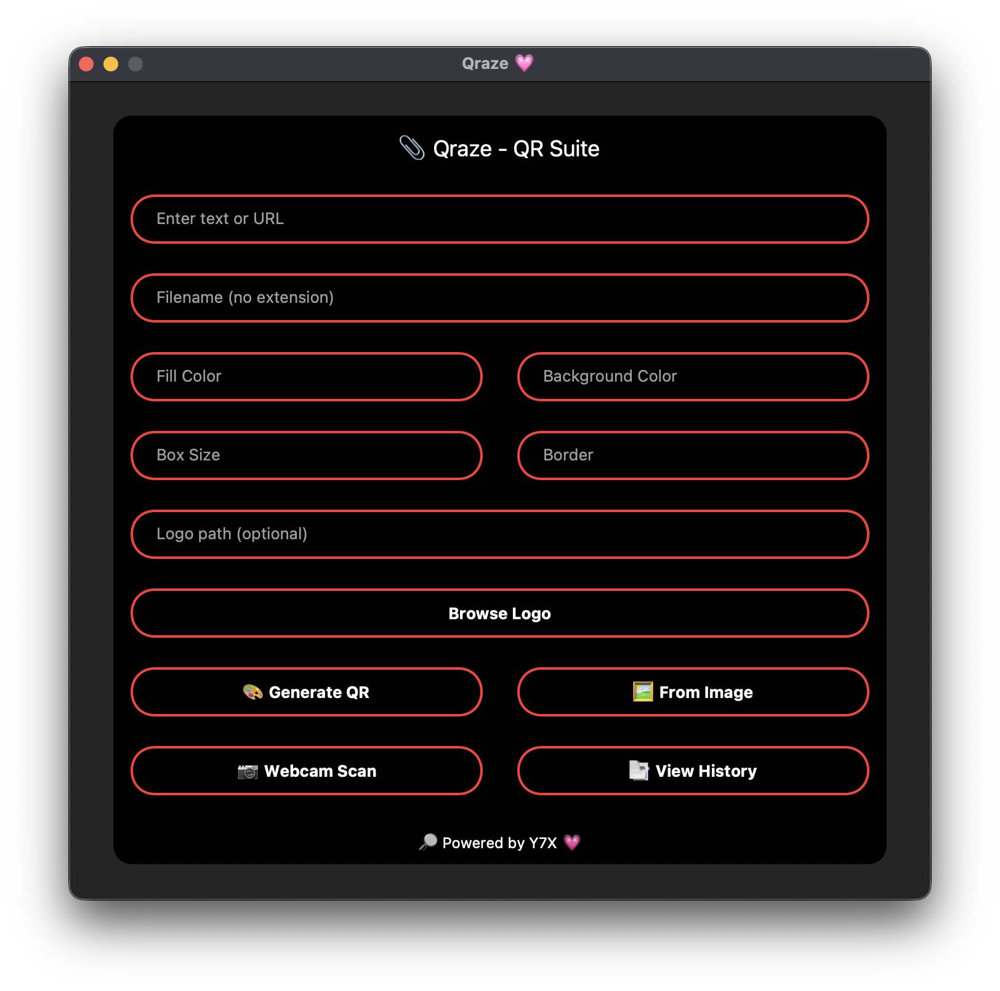

<div align="center">

# ✨ Qraze — QR Code Generator & Scanner
**🚀 Qraze launch: AMOLED UI, red border magic & all features live**

🔒 Design meets Utility
Fully customizable | AMOLED Dark UI | Red-Outlined Power ⚡



</div>

---

## 🌟 Features at a Glance

- 🎯 **Generate** QR codes for text, links, or anything!
- 🎨 Customize **fill**, **background**, **logo**, **box size**, and more.
- 📸 Scan QR from **images** or **webcam** in real-time.
- 🕹️ Minimalist GUI with **pitch-black background** and **red glow outlines**.
- 📝 **History log** with timestamps & clipboard auto-copy.
- 💾 Save QR images with logos in high-quality `.png`.

---

## 🖥️ Installation

> Python 3.9 or later required

```bash
git clone https://github.com/Y7X-bit/Qraze.git
cd Qraze
pip install -r requirements.txt
python Qraze.py